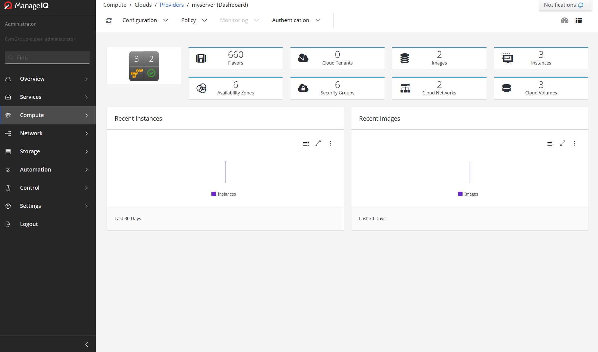
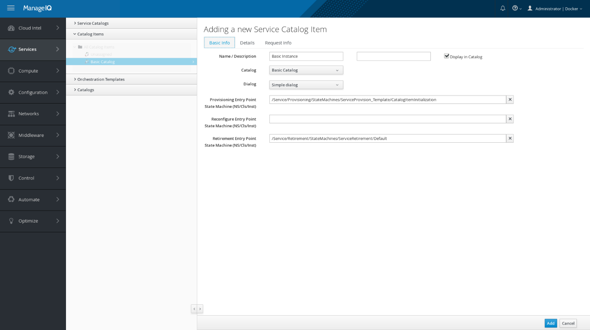
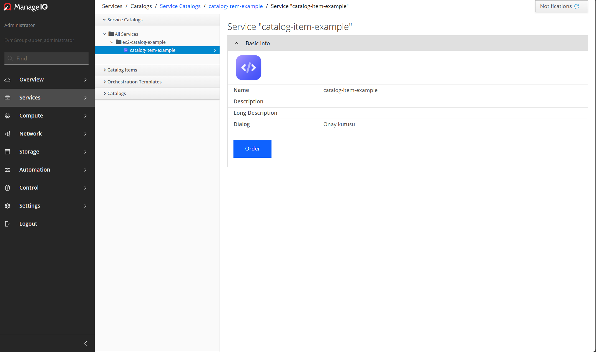
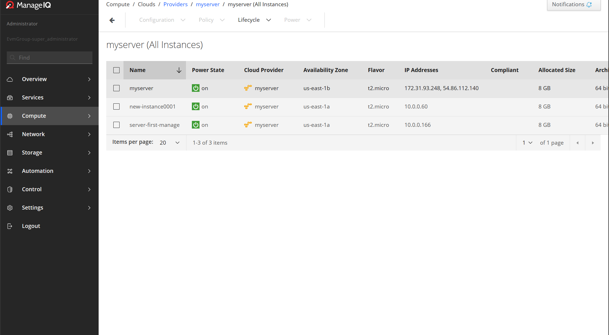

# ManageIQ 
## İçindekiler
   - [Kurulum](#kurulum)
   - [AWS Provider Örneği](#aws-örneği)
     - [Catalog Oluşturma Örneği](#catalog-oluşturma-örneği)
  

## ManageIQ nedir ?
ManageIQ, hibrit bulut için yönetim platformudur. Özel ve genel buluttaki makinelerinizi yönetmenin kolay bir yolunu sunar. Sanal makineler, konteynerler gibi teknolojileri destekler. Ortamın durumunu tarayıcıda görüntüler. Kullanıcıya hizmetleri kontrol etme seçeneği sunar. ManageIQ ayrıca performansı ve ortamın kullanımını optimize etmek için de kullanılır.   
## Kurulum

- Docker ile Kurulum;
````bash
sudo systemctl start docker
````
````bash
docker pull manageiq/manageiq:petrosian-1
````
````bash
docker run -d -p 8443:443 manageiq/manageiq:petrosian-1
````

- Default olarak ``localhost (https://127.0.0.1:8443)`` portunda çalışır.
- Default kimlik bilgileri ;
  - user : admin
  - password : smartvm


## AWS örneği

- Menude ``compute > clouds > providers ``  yolunu izledikten sonra ``Add a New Providers`` Butonuna tıklıyoruz  ve orada aws seçeneğini seçiyoruz.
- AWS de IAM kullanarak bir role tanımlıyoruz ve `Access Key ID` ve `Secret Access Key`  oluşturuyoruz ve gerekli alanları dolduruyoruz. 

#### Herşeyi doğru yaptığınızda bu şekilde görünecektir;

<center></center>


- Gördüğünüz gibi en soldaki iconda  aws logosu kaçtane instancenin olduğu ve bazı bilgiler yer almakta.
- Dashboardda instancelerin gözüktüğü butonu kullanarak instancelerin detaylı bilgisine ulaşabilir ve açma kapatma silme vs. gibi işlemleri basitçe gerçekleştirebilirsiniz.

## Catalog Oluşturma Örneği

Cataloglar hizmetleri kolay bir şekilde Automate etmemize olanak sağlar.

- Menude `Automation > Embedded Automate > Customization` Yolunu izlediğinizde `Service Dialog` Kısmından yeni bir dialog oluşturuyorsunuz. Örneğin "Eminmisiniz ? " şeklinde olabilir bu dialog Automate edeceğimiz hizmetin müşteriler tarafından kullanılma isteğini onaylamak için kullanılacaktır.
- Şimdi yeni bir instance açmanın Automate hizmetini yapacağız. Öncelikle Menuden `Services > Catalog ` yolunu izleyip karşımıza çıkan menuden önce `Catalogs ` kısmından bir catalog oluşturuyoruz daha sonra asıl hizmeti oluşturacağımız `Catalog Items` kısmından 
gerekli bilgileri girdikten sonra yeni bir item oluşturuyoruz.

### Yeni bir instance oluşturma hizmeti formu şu şekilde Gözükecektir;
<center></center>


### Herşeyi Doğru bir şekilde Yaptığımızda `All Services ` kısmında oluşturduğumuz hizmet şu şekilde gözükecektir;

(Hizmetin İconunu ben bu şekilde yaptım istediğiniz isim veya iconu verebilirsiniz)

<center></center>

`Order` Butonuna bastığınızda daha önce oluşturduğumuz dialog karşınıza çıkacak ve onaylamanız durumunda yeni instanceniz oluşacaktır.

### `new-instance0001` adında yeni bir instance oluşturuldu;

<center></center>

Bu şekilde Müşterilerinize çok daha kolay bir kullanım arayüzü sağlayabilirsiniz.


